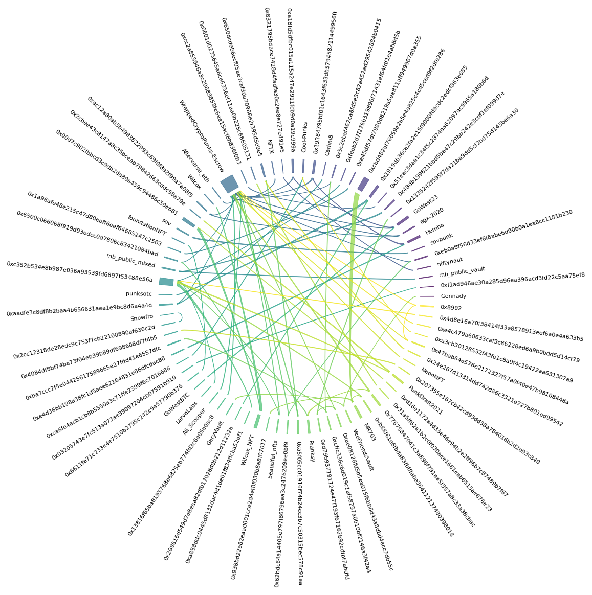

# Wash Trading Identification Through Visualisation
Masters project for NFT wash trading identification utilising visualisations.
Uses data up to 18th April 2022 for analysis.

## Visualisations
These are all run with their own script files from the base folder.

### Cluster analysis:

> source cluster.sh series method d

Where:
- series: the name to dertemine which series to graph
- method: the method of analysis
    - FAMD
    - K-Prototype
    - PCA
    - K-Means
    - K-Mode
    - MCA
- d: the number of dimensions or clusters

### Networks:

> source networks.sh series method time_start time_end method_number

Where:
- series: the name to dertemine which series to graph
- method: the method of analysis
    - common_singles
    - common_pairs
    - common_pairs_text
    - common_sequences
    - common_associations
    - simple_loops
    - simple_loops_text
- time_start: eliminate transactions before this time (set to 0 to ignore)
- time_end: used with time start to select a window of transactions
- method_number: used with methods that require additional numbers

### Chord Diagrams

> source chords.sh series method time_start time_end method_number amount

Where:
- series: the name to dertemine which series to graph
- method: the method of analysis
    - simple_common_chord
    - simple_common_pairs_chord
    - simple_common_sequences_chord
    - simple_common_associations_chord
    - simple_common_loops_chord
- time_start: eliminate transactions before this time (set to 0 to ignore)
- time_end: used with time start to select a window of transactions
- method_number: used with methods that require additional numbers
- amount: number of addresses to plot from the top

### Hypergraphs

> source hypergraphs.sh series method time_start time_end method_number amount sharing_restriction

Where:
- series: the name to dertemine which series to graph
- method: the method of analysis
    - basic_hypergraph_addresses
    - basic_hypergraph_ids
    - basic_hypergraph_pairs
    - basic_hypergraph_pairs_ids
    - basic_hypergraph_sequences
    - basic_hypergraph_sequences_ids
    - basic_hypergraph_associations
    - basic_hypergraph_associations_ids
    - basic_hypergraph_loops
    - basic_hypergraph_loops_ids
    - restricted_hypergraph_addresses
    - restricted_hypergraph_pairs
    - restricted_hypergraph_sequences
    - restricted_hypergraph_associations
    - restricted_hypergraph_loops
- time_start: eliminate transactions before this time (set to 0 to ignore)
- time_end: used with time start to select a window of transactions
- method_number: used with methods that require additional numbers
- amount: number of addresses to plot from the top
- sharing_restriction: amount of addresses an NFT node must occur in in order to be plotted

## Set-up
1. Clone repository
2. Navigate to repository folder
3. Run
> source setup.sh

Enter back into env with:
> source venv.sh

Leave with:
> deactivate

## Usage
### Data
In order to get CSV files:
> source gatherer.sh id_start id_end series

Where:
- id_start: the id to start gethering from
- id_end: the id to stop gathering at
- series: the name to determine which series to gather
